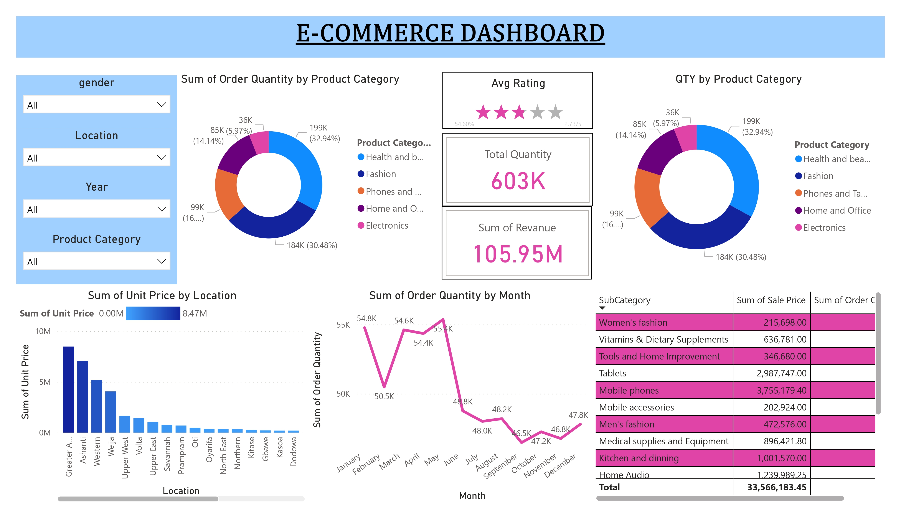

# E-Commerce Dashboard

  

## Dataset: Data description
The dataset captures comprehensive information on sales transactions. It includes essential details such as the OrderDate, which signifies when an order was placed, and the unique OrderID associated with each transaction. The Delivery Date indicates when the ordered items reached the customer. Customer information, like a unique identifier (CustomerID), age, and gender, offers insights into the demographics of those placing orders. Location and Zone provide geographical context, specifying where the order originated. Delivery Type classifies orders based on delivery speed. Product-related details encompass Product Category, SubCategory, and the specific Product name. Unit Price reveals the cost per item, while Shipping Fee accounts for delivery charges. Order Quantity quantifies the number of items ordered, and Sale Price calculates the total order cost. Status updates (processed, shipped, completed) and Reasons for any issues or cancellations provide transaction status insights. Lastly, customer satisfaction is gauged through Ratings assigned by customers to their orders.
